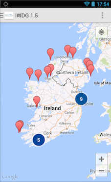
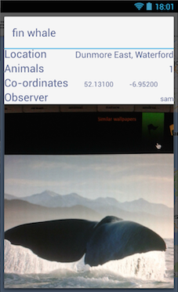
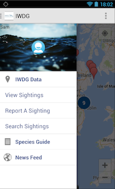
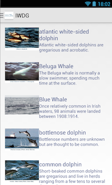
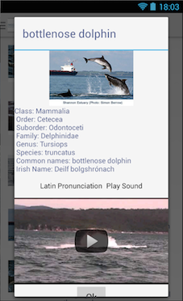

Android App aimed at the IWDG
========================

Currently developing an Android application that may used by Irish Wildlife Organizations such as the Irish Whale and Dolphin Group (IWDG). As it stands many organizations don't have an app of any kind, only a website that members and non-members can interact with.
This project aims to fill that gap in the market, as well as utilize the features and functionality provided by a mobile environment to innovate and create an exciting and productive platform for discovering and sharing Irelands Wildlife.

Research Phase:

- Collaborated with members from IWDG from September ‘13 to December ‘13 to elicit the requirements, as well as conducting my own research.
- Produced a prioritised list of features and associated Gantt Chart to schedule the start and completion of each feature.

Currently:

- Working to completion at the moment in an iterative fashion by producing a working prototype week to week under the guidance of my Project Supervisor. 

- Map of 20 of the most recently reported Sightings

- Details of a selected Sighting

- Navigation Drawer

- Searching for a particular sighting or a set of sightings

- Species Guide

- Info on a particular Species with an embedded YouTube video

